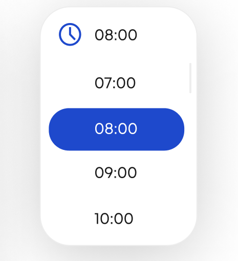

# Bike Rental Boilerplate - ReactJS

React date range picker for renting a bike.
Author: Douglas
Objective: Create a date range picker

Glossary:
current implementation: none
range picker: input for selecting a date range in a calendar

Overview:
the user needs a way to select the period of time that it wishes
to rent the bike

there is no way to select date.
proposal is this:


Design discussion:
design shows a simple one-month view. for selecting multiple
months need to click on the arrow. cannot go in the past.
past days are disabled. cannot change year, must go through each month.
must click on the start and end date? for single day just one click;
add a time picker. after selecting the days shows a time picker.
price update automatically after selection. price has no fraction by hour
so one hour in one day counts a full day.



Open questions:
- whats the best approach for selecting the time?
- how the user should edit the time after making a selection. should go through the calendar again?
- maybe have a month selector?
- maybe have a year selector?
- must reload page to de-select range
- how to show error messages?
- handle already rent days

Testing plan:
- select one day
- select multiple days in the same week/row
- select multiple days in different weeks/rows
- select multiple days in different months
- show a thank you message

---

- Create a rent component inside of the bike-detail page (see Figma)
- Whenever the user picks a Date range, the system displays the final amount and fees
- Feel free to use an external package for the date picker
- Whenever the user clicks on Add to booking button, the app rents a bike
- Connect the UI with the API Endpoints
---

- challenge@trio.dev
- Create a Technical Design for your approach. Make sure to include an analysis of the project structure and share your thoughts.
- Record a video with your screen and camera walking through your solution
- Submit your project by answering all fields on the next page: https://zion.trio.dev/interview/technical-challenge/3b31d676-f3bc-4d2b-9b66-6cafb3aae3c7/9e12a50c-dff5-4eb6-a453-400ec643ab2e

 

This project was created for the Trio Challenge, where candidates must create a functional system to rent bikes.

## Stack used

- [ReactJS](https://reactjs.org/docs/getting-started.html)
- [TypeScript](https://www.typescriptlang.org/docs/)
- [Material UI](https://mui.com/pt/material-ui/getting-started/overview/)

## How to run it

Install node modules:

```sh
yarn
```

Runs the app in the development mode.

```sh
yarn start
```

Open [http://localhost:3000](http://localhost:3000) to view it in the browser.

The page will reload if you make edits.

## How to run the tests

```sh
yarn test
```

Or use paths to run specific component/page test

```sh
yarn test <PATH_TO_COMPONENT>
```

It launches the test runner in the interactive watch mode.

## Folder structure

- [assets/](./src/assets)
  - [fonts/](./src/assets/fonts)
- [components/](./src/components)
  - [BikeCard/](./src/components/BikeCard)
  - [BikeImageList/](./src/components/BikeImageList)
  - [BikeImageSelector/](./src/components/BikeImageSelector)
  - [BikeList/](./src/components/BikeList)
  - [BikeSpecs/](./src/components/BikeSpecs)
  - [BikeType/](./src/components/BikeType)
  - [BookingAddressMap/](./src/components/BookingAddressMap)
  - [Header/](./src/components/Header)
- [mocks/](./src/mocks)
  - [Bike.ts](./src/mocks/Bike.ts)
- [models/](./src/models)
  - [Bike.ts](./src/models/Bike.ts)
- [pages/](./src/pages)
  - [BikeDetails/](./src/pages/BikeDetails)
  - [Home/](./src/pages/Home)
  - [Login/](./src/pages/Login)
- [routes/](./src/routes)
  - [app.routes/](./src/routes/app.routes.tsx)
  - [index/](./src/routes/index.tsx)
  - [paths/](./src/routes/paths.ts)
- [services/](./src/services)
  - [api/](./src/services/api.ts)
- [styles/](./src/styles)
  - [global.css/](./src/styles/global.css)
  - [theme/](./src/styles/theme.ts)
- [App.tsx](./src/App.tsx)

## Overview

### Desktop

https://user-images.githubusercontent.com/42481884/200061794-1ec4771f-de22-4007-9952-3d36b44feed2.mp4

### Mobile

https://user-images.githubusercontent.com/42481884/200061823-e73cd233-8a32-417c-a4ef-af38f81a6824.mp4

## Test coverage (so far)


